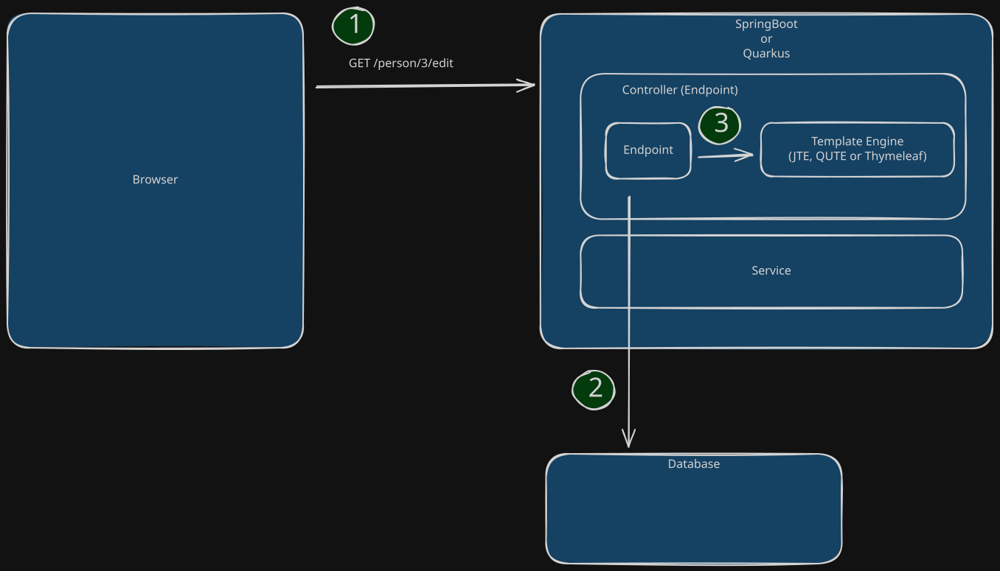
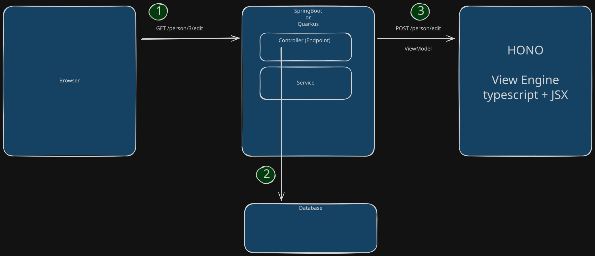

# PoC Application for SpringBoot - Hono Architecture

When I played around with [Hono](https://hono.dev/) I (mostly a SpringBoot and Angular developer)
was surprised how easy and painless and fun it is to generate HTML code on the backend using Hono's JSX compared to using a Java template engine like Thymeleaf.

So I was trying think about how I could use it without throwing away my SpringBoot knowledge and code I already have.  
Since it is probably not possible to use it in the same JVM as I can do with Thymeleaf  
I came up with the following (probably rather unusual) archtecture/stack:

Browser -> Spring Boot Application -> Hono Application.

## Traditional Setup

Traditionally Hypermedia-driven Applications with Springboot use a Java based template engine to generate HTML:

1. Browser makes HTTP request to backend
2. Backend receives HTTP request and for example retrieves data from a database
3. then it uses a template engine do generate HTML for that data
4. Backend sends generated HTML back to the browser

## Spring Boot Hono Setup

Since the Hono code cannot live as template engine inside the Spring Boot Application
it is living (as originally intended) in it's own server.    
But it's only purpose here is the HTML generation. Just like a Thymeleaf template engine.  
All standard Spring Boot code (like security, DB access etc.) stays as it is.  
Only the last step changes: instead of calling Thymeleaf  
a HTTP POST request with the view model in JSON form is sent to the Hono application.  
Back comes the HTML which Spring Boot simply returns to the browser.

1. Browser makes HTTP request to Spring Boot
2. Spring Boot receives HTTP request and for example retrieves data from a database
3. Spring Boot calls the Hono application to generate HTML for the retrieved data 
4. Spring Boot sends generated HTML back to the browser

## Development

### Build it

- You need to have bun installed for Hono and Java with Maven for Spring Boot.
- Invoke: `package.json: script: genjava`

### Run it

You need to have bun installed for Hono and Java with Maven for Spring Boot. 

1. Start the Spring Boot App: `Application.java`
2. Start the Hono App: `package.json: script: dev`
3. Open Browser at `localhost:8080` and you should be able to use the PoC application (login with user/x21)  
 

